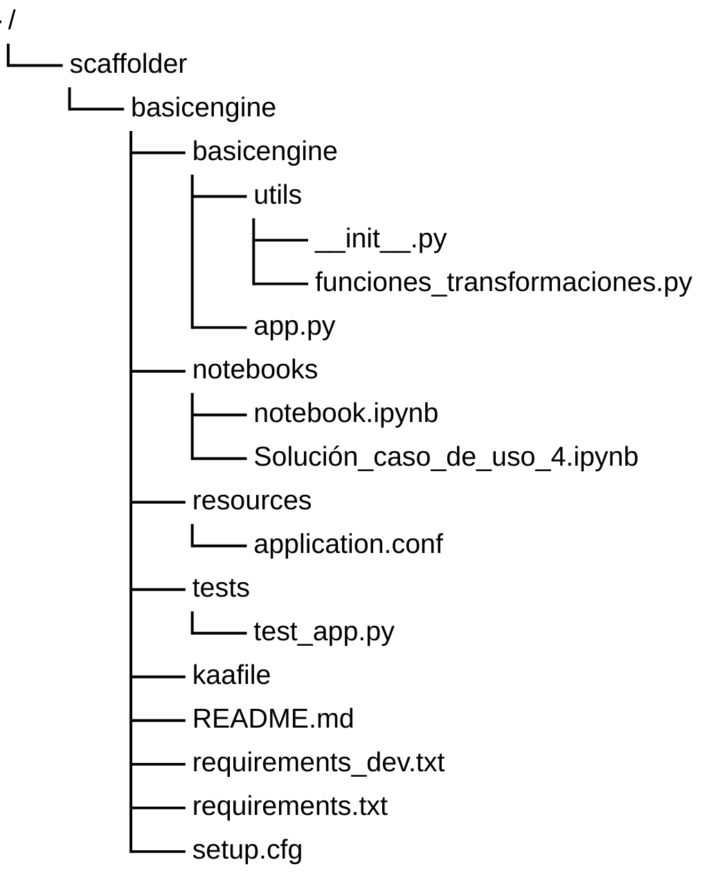

Ejercicio básico para aprender a usar git

### Estructura básica del repositorio.

- __Carpeta project.name__: Dentro de cada engine hay una carpeta que tiene el mismo nombre del engine donde se encuentran los archivos principales
    - __app.py__: Archivo principal ejecutable del proyecto, inicia y ordena las operaciones principales
    - __Capeta utils o business__: En caso de ser necesario, incluye modulos y el archivo obligatorio __ init __.py
- __Carpeta notebooks__: Contiene los notebooks del proyecto, archivos interactivos donde escribir y ejecutar código, visualizar datos y anotar observaciones
- __Carpeta resources__: Como archivo principal tiene __application.conf__ donde se guardan las variables de entorno
- __Carpeta test__: Contiene archivos .py de test unitarios para probar y validar el funcionamiento correcto del código. La estrucutura y disposición de los modulos de test debe ser igual a la carpeta de código. Los modelos de test se recomienda que se llamen igual que los módulos que prueban pero con "test_" por delante del nombre
    - __test_app.py__
- __kaafile__ y __setup_cfg__: Son ficheros de configuración del proyecto que contienen información sobre la instalación y configuración del mismo
- __requirements.txt__ y __requirements_dev.txt__: Contienen las dependencias del engine con otros módulos o librerías externas. En el dev se encuentras las dependencias para correr los test
- __readme.md__: Fichero readme para la descripción del proyecto, proporcionando una visión general y guía de uso. 